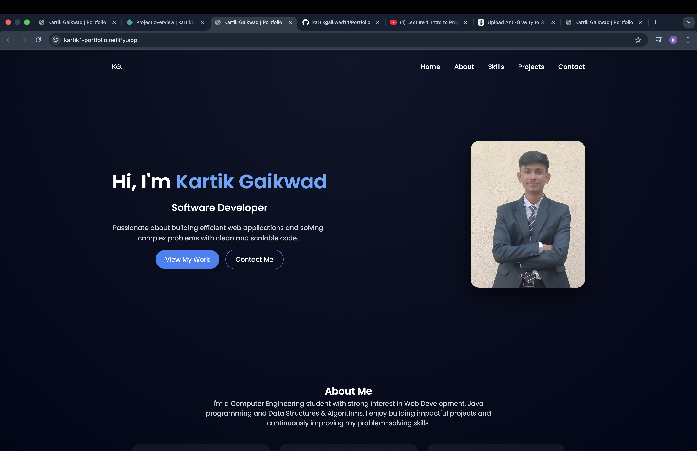
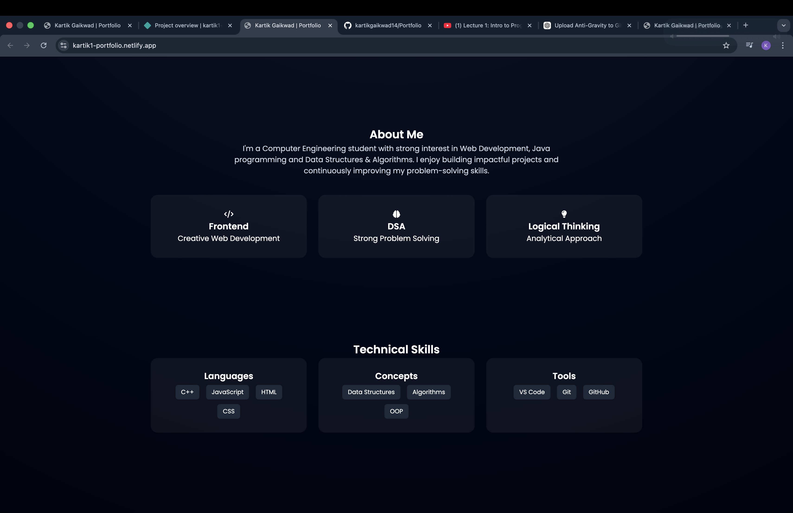
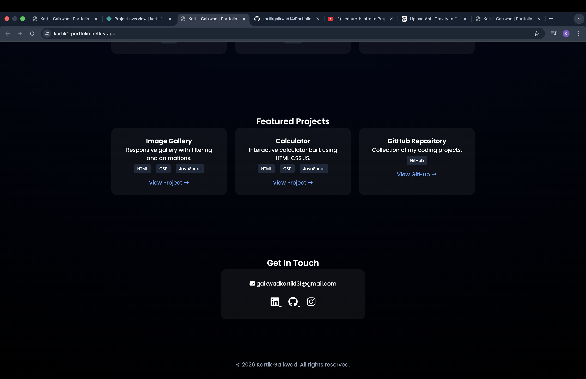

# Kartik Portfolio Website

This is my personal **Developer Portfolio Website** where I showcase my projects, skills, and contact information.

🌐 **Live Website:**
https://kartik1-portfolio.netlify.app/

---

## 🚀 About the Project

This portfolio website is designed to present my work and technical skills in a clean and modern interface. It includes sections such as:

* Home
* About Me
* Projects
* Skills
* Contact

The website highlights my work in **Web Development and Programming**.

---

## 🛠️ Technologies Used

* HTML
* CSS
* JavaScript

---

## 📸 Project Screenshots

### Portfolio Homepage

### Portfolio Section View

### Contact / Project Section

---

## 📂 Project Structure

portfolio-website
│
├── index.html
├── style.css
├── script.js
├── portfolio-home.png
├── portfolio-section.png
├── portfolio-contact.png
└── README.md

---

## ✨ Features

* Modern responsive UI
* Smooth animations
* Project showcase section
* Skills section
* Contact form

---

## 👨‍💻 Author

**Kartik Gaikwad**
Computer Engineering Student
DY Patil Institute of Technology, Pimpri

---

## ⭐ Support

If you like this project, consider giving it a ⭐ on GitHub.
